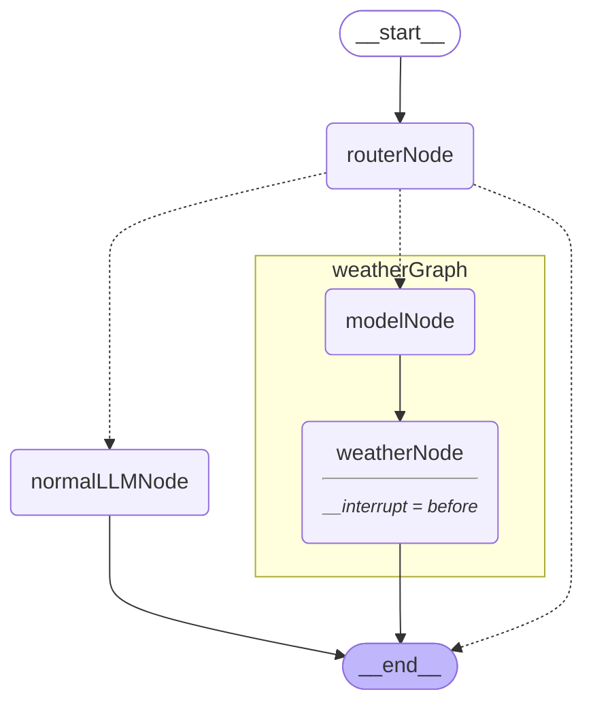

# learnMCP

```mermaid
graph TD;
        __start__([<p>__start__</p>]):::first
        routerNode(routerNode)
        normalLLMNode(normalLLMNode)
        weatherGraph_modelNode(modelNode)
        weatherGraph_weatherNode(weatherNode<hr/><small><em>__interrupt = before</em></small>)
        __end__([<p>__end__</p>]):::last
        __start__ --> routerNode;
        normalLLMNode --> __end__;
        weatherGraph_weatherNode --> __end__;
        routerNode -.-> normalLLMNode;
        routerNode -.-> weatherGraph_modelNode;
        routerNode -.-> __end__;
        subgraph weatherGraph
        weatherGraph_modelNode --> weatherGraph_weatherNode;
        end
        classDef default fill:#f2f0ff,line-height:1.2;
        classDef first fill-opacity:0;
        classDef last fill:#bfb6fc;
```
